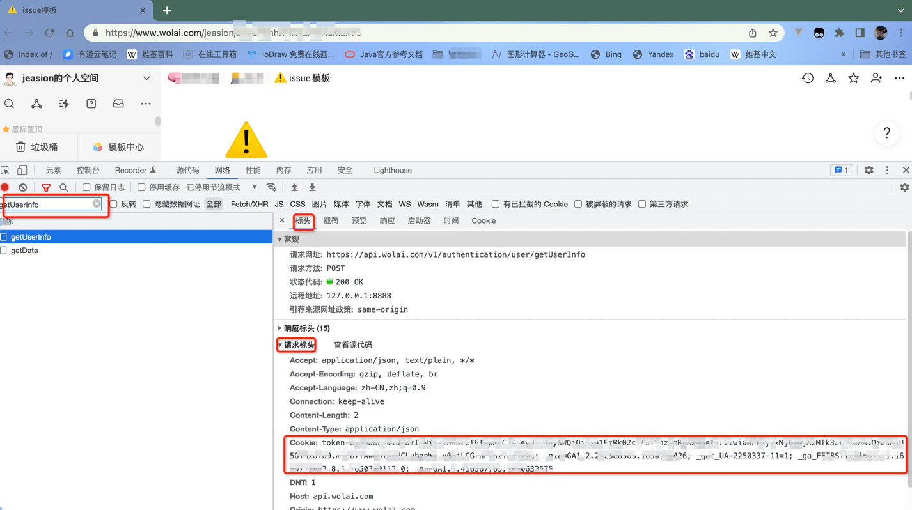
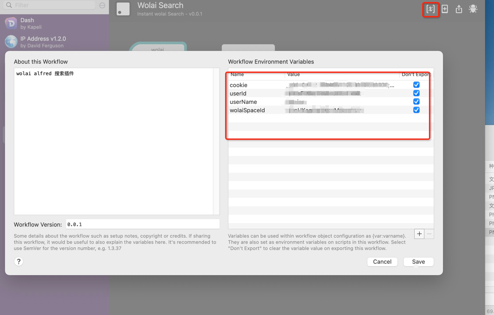
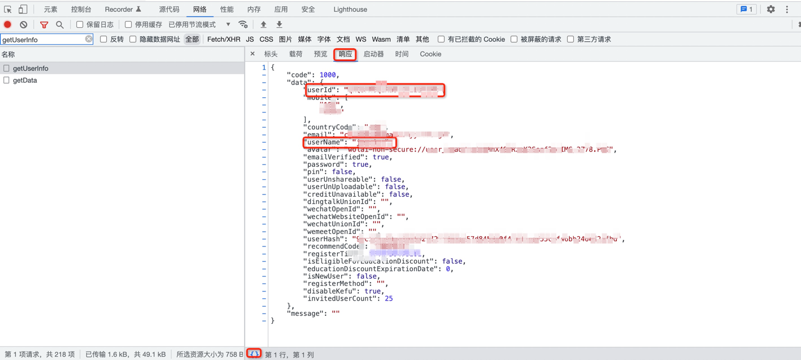

# Wolai Alfred 搜索插件

1. 因个人能力有限,搞JAVA的,不熟悉Python和Alfred,此版本目前只支持网页版本,不支持客户端版本,后续可能会支持,并维护添加新功能
2. wolai的history似乎是本地缓存的查询,不涉及到HTTP请求,所以浏览历史暂时也没想到咋整
3. 如有问题,请GitHub提交issue(请勿提交百度上就能找到的问题,浪费大家时间,当然给钱的话另说,咨询一次20块),
4. 因为本人非Python使用者,写的很简单,也可能在大佬看来也很烂,欢迎大佬搞PR,甚至可以在issue上提交自己写的,我也会贴到README里面,给你引流

## 系统变量
- wolaiSpaceId
- cookie
- userId
- userName

## 食用方法
0. 如直接输入https://www.wolai.com/不能进入个人页面,则先登录wolai
1. 打开浏览器F12开启调试台,并切换至[网络],建议使用Firefox,直接中文,Chrome默认英文
2. 输入网址: https://www.wolai.com/
3. 在请求筛选框内输入"getUserInfo",找到对应的请求,并单击
4. 在[标头]处找到[请求标头],将其中的[Cookie]里面的内容复制下来
    格式类似:"token=I6IkpXVCJ9.eyJ1Td9.mzCb7fA; _gid=GA1; _gat_UA-..."
5. 将其复制下来,并粘贴到Alfred的cookie参数里面
   
   
6. 返回F12调试台,找到响应,点击"{}"将数据格式化,然后从中找到[userId],[userName],并参照第5步将参数填入Alfred
   
7. 重复第3步,将输入框内容转换为"getWorkspaceData",如未找到,直接刷新网页,参照第6步找到[workspaces]下的[id],格式类似:"rjQnUKagSwDQx1MG",并填入Alfred
8. 在Alfred输入[wolai 关键字], 如[wolai issue],即可以默认浏览器跳转到对应网页
    效果如图:
  
## 下载地址
   见上面源码中的 Wolai.alfredworkflow
## 恰饭
   虽然写的很简单,但我还是有脸皮恰饭,愿意打赏的给个1~5块,不要多给,我不配
 

